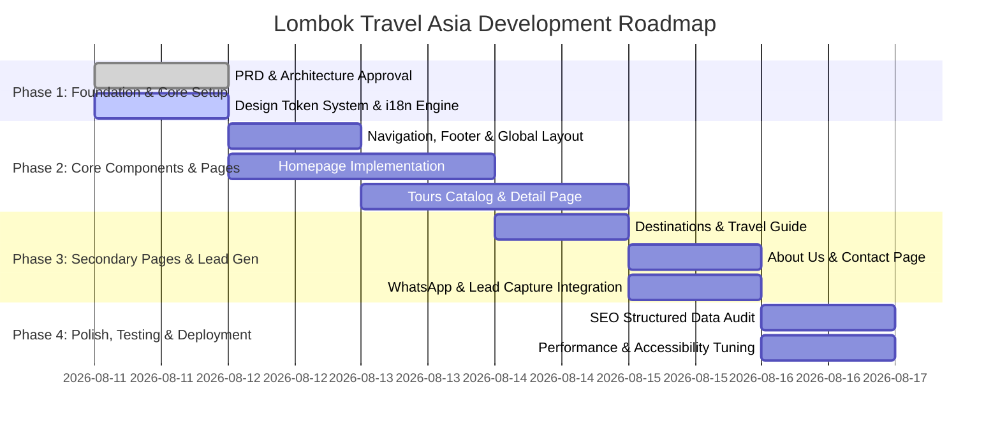

# Product Requirement Document (PRD)
## Lombok Travel Asia — Premium Travel & Adventure Web Platform

---

## 1. Executive Summary & Vision

### 1.1 Overview
**Lombok Travel Asia** is a next-generation, high-converting digital web platform designed to connect international and domestic travelers with authentic, premium travel experiences in Lombok, Indonesia. The platform seamlessly combines editorial travel storytelling, interactive tour curation, multi-language support (English & Indonesian), and friction-free direct booking via WhatsApp.

### 1.2 Vision Statement
To establish **Lombok Travel Asia** as the premier, trusted digital portal for curated Lombok experiences — ranging from Mount Rinjani expeditions and Gili Islands escapes to hidden beaches and rich Sasak cultural immersion.

### 1.3 Core Objectives & Business Goals
- **Conversion-Driven Architecture**: Maximize direct inquiries and bookings via optimized WhatsApp CTA flows and interactive contact forms.
- **Unrivaled Aesthetics & UX**: Deliver a visually captivating, modern, and fluid design (Material Design 3 custom palette, smooth micro-interactions, dark/light modes).
- **SEO & AEO Excellence**: Rank #1 on search engines (Google, Bing) and AI search engines (Perplexity, ChatGPT, SearchGPT) through dynamic Schema.org structured data, semantic HTML5, and multilingual optimization.
- **Lightning-Fast Performance**: Achieve sub-second Core Web Vitals using Next.js 16 App Router, Turbopack, and optimized responsive media asset delivery.

---

## 2. Target Personas & User Journeys

| Persona | Archetype | Key Needs & Pain Points | Target Features |
| :--- | :--- | :--- | :--- |
| **Adventure Seeker** | Trekker / Thrill-seeker (22-45 yrs) | Detailed itineraries, safety compliance, gear lists, altitude info, physical difficulty ratings. | Mount Rinjani Detail Page, Itinerary Timeline, Equipment Checklist, Guide Certifications. |
| **Luxury Escapist** | Honeymooners & Couples (28-55 yrs) | Premium comfort, island hopping, private transfers, instant personalized consultation. | Gili Island Cruising, Private Beach Villas Curation, WhatsApp Direct Concierge. |
| **Cultural Explorer** | Families & Cultural Enthusiasts | Authentic local interactions, transparent pricing, multi-day flexible itineraries. | Sasak Village Tours, Travel Guide / Blog, Multilingual (EN/ID) Switcher. |

---

## 3. Tech Stack & Architecture

### 3.1 Technology Stack
- **Framework**: Next.js 16 (App Router with Turbopack)
- **UI & React Version**: React 19, TypeScript 5
- **Styling**: Tailwind CSS v4 + Vanilla CSS Design Tokens (Custom Material Design 3 Palette)
- **Animation & Motion**: Motion (`framer-motion`), Lucide React icons
- **Form & Validation**: React Hook Form + Zod
- **Localization**: Native JSON-based i18n (`en` and `id` dictionary system with cookie/header locale detection)
- **SEO / GEO / AEO**: Schema.org JSON-LD generators (`TouristTrip`, `TravelAgency`, `LocalBusiness`, `FAQPage`, `Article`, `BreadcrumbList`)

### 3.2 Key System Components
1. **App Router Structure (`src/app/`)**:
   - `/`: Dynamic Homepage (Hero, Search/Filter, Featured Journeys, Why Us, Testimonials)
   - `/tours`: Filterable Tours Catalog (Category, Difficulty, Duration, Price)
   - `/tours/[slug]`: Rich Tour Detail Page (Gallery, Itinerary Accordion, Inclusions/Exclusions, FAQs, WhatsApp Sticky Booking CTA)
   - `/destinations`: Interactive Lombok & Gili Destination Guide
   - `/travel-guide`: SEO Articles & Local Expert Guides
   - `/about`: Company Story, Philosophy, Team & Local Commitment
   - `/contact`: Interactive Inquiry Form + Direct Contact Information
2. **Data Layer (`src/content/`)**:
   - Strongly typed `tours.ts` dataset containing bilingual content, structured metrics, itineraries, images, and price structures.
3. **Structured Data Layer (`src/lib/structured-data.ts`)**:
   - Utility functions for Schema.org entity graphs.

---

## 4. Design System & Aesthetics

### 4.1 Color Palette (Material Design 3 Lombok Palette)
- **Primary (Forest Rinjani Green)**: `#012d1d` (Container: `#1b4332`, Text: `#86af99`)
- **Secondary (Warm Earth / Volcanic Sand)**: `#5f5e59` (Container: `#e5e2db`)
- **Tertiary (Ocean Sapphire Blue)**: `#002842` (Container: `#003f63`, Text: `#59adef`)
- **Surface & Canvas**: `#fcf9f8` / Warm Canvas `#fcfbf9` / Contrast Dark `#1b1c1c`

### 4.2 Typography System
- **Display Headings**: `Playfair Display` / `Cinzel` (Editorial luxury feel)
- **Body & UI**: `Inter` / `Geist Sans` (High legibility across mobile & desktop screens)

### 4.3 Motion & Interactive UX
- Micro-animations on cards, buttons, and navigation elements.
- Smooth sticky navigation bar with glassmorphism blur background.
- Sticky WhatsApp floating button with pre-filled dynamic inquiry templates.

---

## 5. Functional Requirements & Feature Matrix

### 5.1 Dynamic Homepage
- **Hero Section**: High-impact editorial imagery, compelling headline, clear value proposition.
- **Trip Search Bar**: Filter by destination (Rinjani, Gili, South Lombok), dates, and traveler count.
- **Featured Journeys Carousel/Grid**: Cards showcasing top-rated tours with rating badges, duration, difficulty, and price.
- **Why Choose Us Section**: Value drivers (Local Expertise, Certified Guides, Flexible Plans, 24/7 Support).
- **Custom Trip Planner CTA**: Banner encouraging tailored itinerary requests.

### 5.2 Tour Catalog & Detail Pages
- **Filtering & Search**: Instant client/server filtering by category, difficulty (`easy`, `moderate`, `challenging`), and duration.
- **Tour Detail Page**:
  - Image Gallery Carousel / Grid with lightbox previews.
  - Quick Info Bar (Duration, Max Altitude, Group Size, Meals, Season).
  - Day-by-Day Detailed Itinerary Timeline with elevation gains.
  - Inclusions (`what's included`) and Exclusions (`what's not included`) checklists.
  - Packing List & Meeting Point details.
  - FAQ Accordion with structured Schema metadata.
  - Sticky WhatsApp Booking Bar on Mobile & Desktop.

### 5.3 Multilingual (i18n) Engine
- Seamless instant language switching between English (`en`) and Indonesian (`id`).
- Content localization across titles, descriptions, buttons, forms, and error messages.

### 5.4 Direct Booking & Lead Generation
- **WhatsApp Integration**: Generates contextual WhatsApp links with tour title, preferred date, traveler count, and custom notes.
- **Contact Form**: Validated with Zod, success notifications, and instant WhatsApp fallback trigger.

---

## 6. Non-Functional Requirements (SEO, Performance, Security)

### 6.1 SEO, AEO, & GEO Engineering
- Semantic HTML tags (`<header>`, `<main>`, `<article>`, `<section>`, `<footer>`, single `<h1>`).
- Automated OpenGraph & Twitter Card metadata for rich social previews.
- Valid Schema.org JSON-LD for Search Engine Knowledge Graphs and AI synthesis engines.
- XML Sitemap & `robots.txt` generation.

### 6.2 Performance & Web Vitals
- **Lighthouse Performance Score**: Target > 95/100.
- Next.js `next/image` optimization with webp/avif generation and responsive `sizes`.
- Zero-layout-shift (CLS < 0.1), LCP < 2.0s, FID/INP < 100ms.

### 6.3 Accessibility (a11y) & Cross-Browser Compatibility
- WCAG 2.1 AA compliance (contrast ratio, keyboard navigation, focus rings).
- Fully responsive across Mobile (320px+), Tablet (768px+), Laptop (1024px+), and Desktop (1440px+).

---

## 7. Implementation Roadmap & Milestones

---

## 8. Success Metrics (KPIs)
- **Conversion Rate**: > 4% visitor-to-WhatsApp inquiry conversion.
- **Engagement**: Average session duration > 2.5 minutes, bounce rate < 40%.
- **Search Rankings**: Top 3 positioning for key terms like *"Mount Rinjani trek organizer"*, *"Lombok island tour agency"*, *"Gili islands private trip"*.
